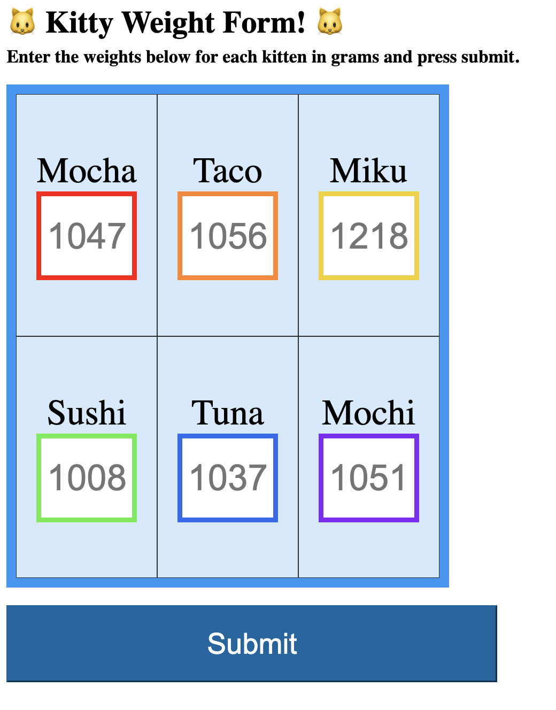
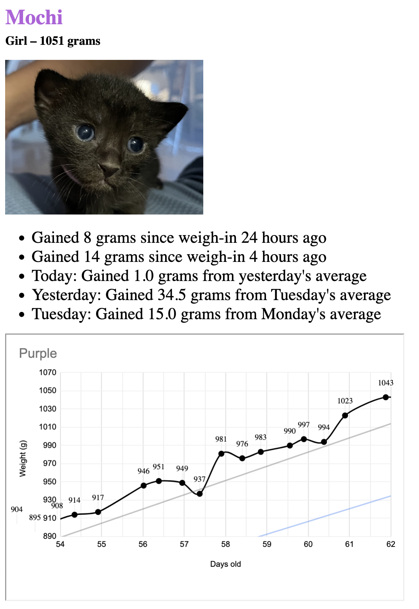

# Kitten App

## Description

A simple web tool for easily recording weights for kittens (or really, any animal), and understanding their progression. It's one solution for the tricky question of "how is my kitten doing?".

## How it works

This is a server-side rendered website using Python's Flask framework using Google Sheets as the database. Google Sheets was used because I was already using it for manually recording weights and visualizing progression using the charts feature. When you submit the weights for one or more kittens, Javascript invokes a backend API which posts the values and timestamp to the spreadsheet, using Google Sheets v4 API. The spreadsheet is configured to automatically generate a chart which is then displayed on the profiles.html page for each kitten.

The Python backend takes this a step further by calculating the recent gains in a 12 and 24 hour period, as well as average gains for the current and past few days. This is meant to give you the best possible insight into positive and negative trends for each kitten.
